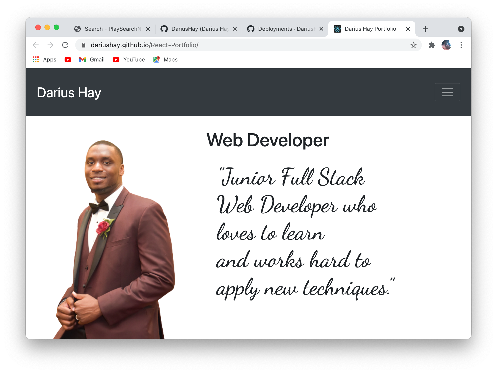

## Project Title

React Portfolio

## Description

This is my personal portfolio as a Junior full Stack Web Developer.

## Table of Content

1. [Installation requirements](#Installation)
2. [Deployed App](#Deployed)
3. [Contributions](#contribution)
4. [screenshots](#Screenshots)
5. [Questions](#questions)

## Installation

 "react", "react-dom", "react-router-dom", "react-spring", "react-scripts"

## Deployed

https://dariushay.github.io/React-Portfolio

## Contribution

Darius Hay https://github.com/DariusHay

## Screenshots

## Questions

If you have any additional questions about this project, you can find me on GitHub at DariusHay https://github.com/DariusHay, or you can email me at dariushay@gmail.com, thank you.